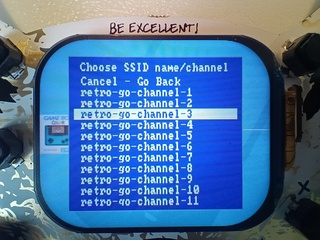
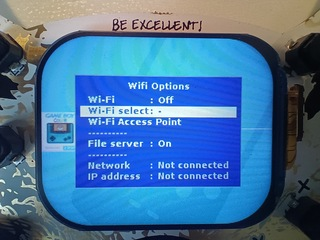
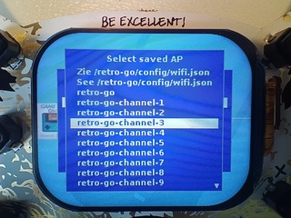
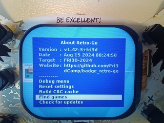
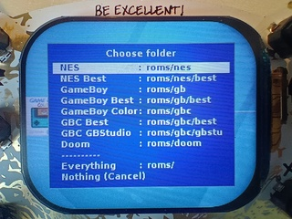
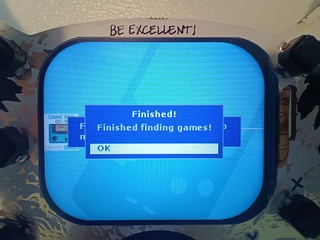

# Retro-Go Gaming

Retro-Go is een programma om oude (maar goeie!) spelletjes op ESP32-gebaseerde toestellen te spelen, zoals de Fri3d Camp 2024 Badge.
Het project bestaat uit een "lanceerder" en een selectie van de beste applicaties en emulators, serieus geoptimaliseerd om minder CPU, geheugen en opslag nodig te hebben, zonder minder compatibel te zijn!

## Bediening

### Algemene knoppen

- `RESET`: herstart de huidige app
- `START+MENU` samen: Ga uit Retro-Go, terug naar de Fri3d App

### Knoppen in de lanceerder

- `Menu`: Vorige scherm
- `Start`: Volgende scherm
- `X`: "Opties" menu:
	- Volume van het geluid
	- Audio out: "Buzzer" die op de badge zit (stil en lage kwaliteit) of "Ext(ernal) DAC" voor de [Communicator](../communicator/) of andere externe luidsprekers
	- Wi-Fi opties:
		- Wi-Fi Access Point: activeer deze, verbind met de hotspot en surf naar http://192.168.4.1/ om de bestanden op de badge te beheren
- `Y`: Menu met "Find games" om te [zoeken op de badge van je vrienden naar spelletjes die jij nog niet hebt](#spelletjes-zoeken)
- `A`: Actie
- `B`: Terug
- Boven/Onder: menuinstelling selecteren
- Links/Rechts: menuinstelling aanpassen

### Knoppen in NES en Gameboy (Color) spelletjes

- `Start`: Start
- `Menu`: Select (bijna nooit nodig)
- `A` en `B`: spelknoppen

### Knoppen in Doom

- `Menu`: Wissel van wapen
- `Start`: Gebruik (deur, knop, schakelaar)
- `X`: Opties menu
- `Y`: Spel Menu
- `A`: Schieten (of slaan)
- `B`: Snel of zijwaarts lopen

## SD Kaartje of intern opslaggeheugen

De badge zal proberen de micro SD kaart (geformatteerd als FAT) te gebruiken en als dat niet lukt, het interne opslaggeheugen.

Als je een nieuwe micro SD kaart insteekt, is het aangeraden om dit eerst te vullen met de laaste nieuwe `default_files_config_and_games.zip` van [de releases pagina](https://github.com/Fri3dCamp/badge_retro-go/releases) zodat je alle juiste standaard instellingen hebt, zoals de wifi netwerken.

## Spelletjes zoeken

Als je graag wil zoeken naar spelletjes die je nog niet hebt op de badge van een vriend, dan kan dat rechtstreeks, zonder dat je een laptop of SD kaartlezer nodig hebt!

Het werkt in 3 stappen:

1) **je vriend zet zijn hotspot aan** *(X knop -> "Wi-Fi options" -> "Wi-Fi Access Point" en kies er eentje, bijvoorbeeld "retro-go-channel-3")*

2) **jij verbindt met zijn hotspot** *(X knop -> "Wi-Fi options" -> "Wi-Fi select" -> "retro-go-channel-3" die je vriend koos)*

3) **jij zoekt naar spelletjes** *(Y knop -> "Find games" -> kies een map)*

Dit kan even duren, maar als je het beu bent kan je het altijd stoppen door je badge te herstarten.
Mocht er een fout optreden, probeer dan eens opnieuw - hij slaat spelletjes over die je al hebt.

*Tip: Zet de beste paar spelletjes in een mapje `/roms/nes/best`, `/roms/gb/best` of `/roms/gbc/best` en zet je zelfgemaakte spelletjes in `/roms/gbc/gbstu` zodat je die gemakkelijk kan terugvinden.*

## Zelf spelletjes maken

Met [GBStudio](https://www.gbstudio.dev/) kan je zelf eenvoudig verschillende soorten spelletjes maken voor GameBoy Color. Als je op YouTube zoekt naar 'GBStudio' vind je een [hele goeie playlist van filmpjes](https://www.youtube.com/watch?v=hNXlV2tt7eE&list=PLmac3HPrav--Q4QKUVknwwMSNk1YECFKT) die je snel alles leren wat je moet weten.

## Over Retro-Go

Retro-go heeft zelf [ondersteuning voor de Fri3d Camp 2024 Badge](https://github.com/ducalex/retro-go/tree/dev/components/retro-go/targets/fri3d-2024) maar de afgeleide versie [retro-go-fri3d](https://github.com/tomvanbraeckel/retro-go-fri3d/) bevat een pak meer toeters en bellen die *te specifiek* zijn voor Fri3d Camp om in de algemene versie te kunnen.

### Ondersteunde systemen:

- Nintendo Entertainment System (NES)
- Gameboy
- Gameboy Color
- DOOM (ook mods!)

Er zijn nog andere systemen ondersteund maar deze zijn niet geactiveerd op de Fri3D Camp 2024 Badge omdat ze minder populair zijn of omdat ze wat te traag werkten.

### Eigenschappen:
- Menu in de spelletjes
- Favorieten en recent gespeelde spellen
- GameBoy kleurenpaletten, klok aanpassen en bewaren
- NES kleurenpaletten, PAL ROMs, NSF ondersteuning
- Opties om het scherm te schalen en te filteren
- Goeie performantie en compatibiliteit
- Turbo Snelheid/Doorspoelen
- Hoesjes en voorbeeldweergave van bewaarde spelstatus
- Meerdere spelstatussen bewaren per spel
- Bestanden beheren via draadloos netwerk
- Vriend-naar-vriend spelletjes ROMs delen
- Aansturing van piezoelektrische zoemer als primitieve luidspreker
- Ondersteuning voor Fri3d Camp 2024 "Communicator" en andere externe luidsprekers

### Schermafdrukken

